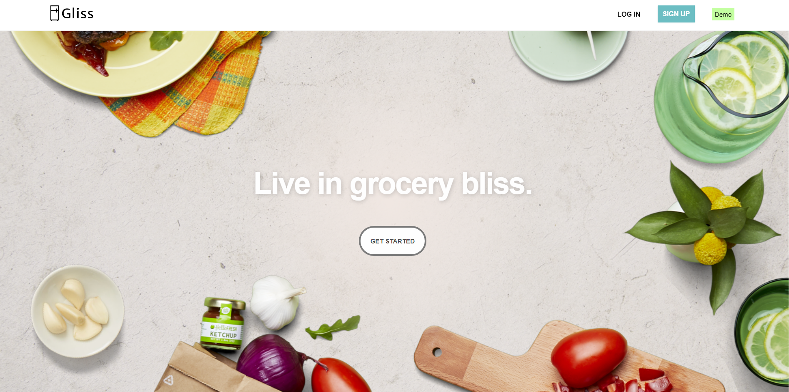
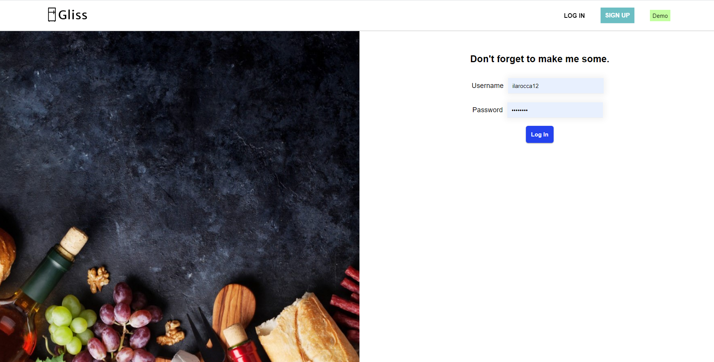
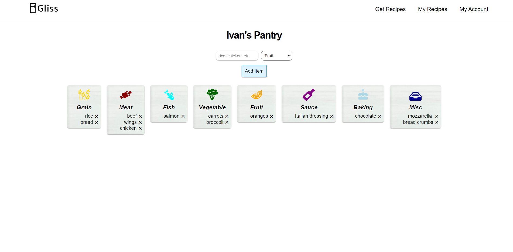
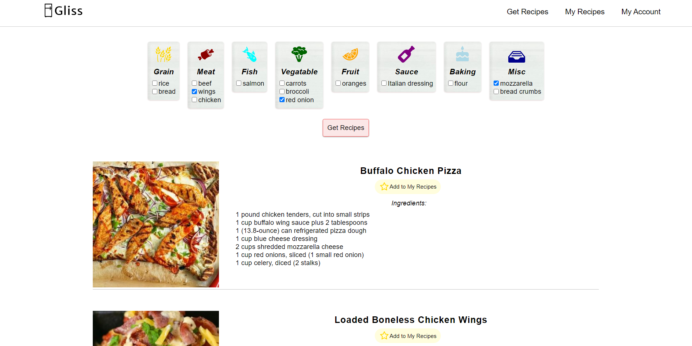
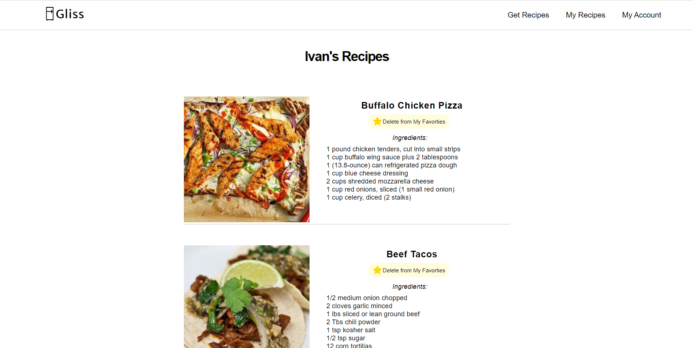

# Gliss

> A grocery managment application that gathers recipes based on your pantry.

This repo is the back-end for Gliss. You can see the app live at [https://gliss-client.vercel.app/](https://gliss-client.vercel.app/)

The app was designed with both mobile and desktop viewing in mind.

To check out the app, you can either sign up or select the demo account.

## Demo

<p><a href="https://gliss-client.vercel.app/" target="_blank">Live Link</a></p>

## Introduction

It can be a daunting task to figure out what to make for dinner each night. Gliss makes viewing your pantry from anywhere easy and privides dinner ideas that you may have never thoughut of with the items that you have.

## Screenshots







## API Overview

```text
/api
.
├── /auth
│   └── GET
│       ├── /current-user
│   └── POST
│       └── /login
|
├── /users
│   └── GET
|       ├── /
│       ├── /:user_id
|       ├── /:user_id/items
|       ├── /:user_id/recipes
|   └── POST
|       ├── /
│   └── DELETE
│       └── /:user_id
|
├── /items
│   └── GET
│       ├── /
│   └── POST
│       ├── /
│   └── DELETE
|       └── /:user_id/:item_id
|
├── /recipes
│   └── GET
│       ├── /
│   └── POST
│       ├── /
│   └── DELETE
|       └── /:user_id/:recipe_id
```

### POST `/api/auth/login`

```js
// req.body
{
  username: String,
  password: String
}

// res.body
{
  user: {
  id: Number,
  firstName: String,
  lastName: String,
  username: String,
  dateCreated: Number,
  }
  authToken: String
}
```

### GET `/api/auth/current-user`

```js
// req.header
Authorization: Bearer ${token}

// res.body
{
  user: {
  id: Number,
  firstName: String,
  lastName: String,
  username: String,
  dateCreated: Number,
  }
}
```

### GET `/api/users`

```js
// res.body
{
  user: {
  id: Number,
  firstName: String,
  lastName: String,
  username: String,
  dateCreated: Number,
  }
}
```

### GET `/api/users/:user_id`

```js
// req.header
Authorization: Bearer ${token}

//req.body
{
  userId: Number
}

// res.body
{
  user: {
  id: Number,
  firstName: String,
  lastName: String,
  username: String,
  dateCreated: Number,
  }
}
```

### GET `/api/users/:user_id/items`

```js
// req.header
Authorization: Bearer ${token}

//req.body
{
  userId: Number
}

// res.body
{
   id: Number,
  item: String,
  categoryId: Number,
  userId: Number,
  dateCreated: String,
}
```

### GET `/api/users/:user_id/recipes`

```js
// req.header
Authorization: Bearer ${token}

//req.body
{
  userId: Number
}

// res.body
{
  id: Number,
  recipeName: String,
  ingredients: String,
  img: String,
  url: String,
  userId: Number,
  dateCreated: String,
}
```

### POST `/api/users/'

```js
// req.header
Authorization: Bearer ${token}

//req.body
{
  firstName: String,
  lastName: String,
  username: String,
  password: String
}

// res.body
{
  user: {
  id: Number,
  firstName: String,
  lastName: String,
  username: String,
  dateCreated: String,
  }
  authToken: String
}
```

### DELETE `/api/users/:user_id`

```js
// req.header
Authorization: Bearer ${token}

//req.body
{
  userId: Number
}
```

### GET `/api/items/`

```js
//res.body
{
  id: Number,
  item: String,
  categoryId: Number,
  userId: Number,
  dateCreated: String,
}
```

### POST `/api/items/`

```js
// req.header
Authorization: Bearer ${token}

// req.body
{
  item: String,
  categoryId: Number,
  userId: Number
}

// res.body
{
  id: Number,
  item: String,
  categoryId: Number,
  userId: Number,
  dateCreated: String,
}
```

### DELETE `/api/items/:user_id/:item_id`

```js
// req.header
Authorization: Bearer ${token}

// req.body
{
  userId: Number,
  itemId: Number
}
```

### GET `/api/recipes/`

```js
//res.body
{
  id: Number,
  recipeName: String,
  ingredients: String,
  img: String,
  url: String,
  userId: Number,
  dateCreated: String,
}
```

### POST `/api/recipes/`

```js
// req.header
Authorization: Bearer ${token}

// req.body
{
  recipeName: String,
  img: String,
  url: String,
  ingredients: String,
  userId: Number
}

// res.body
{
  id: Number,
  recipeName: String,
  ingredients: String,
  img: String,
  url: String,
  userId: Number,
  dateCreated: String,
}
```

### DELETE `/api/recipes/:user_id/:recipes_id`

```js
// req.header
Authorization: Bearer ${token}

// req.body
{
  userId: Number,
  recipeId: Number
}
```

## Technology

#### Back End

- Node and Express
  - Authentication via JWT
  - RESTful Api
- Testing
  - Supertest (integration)
  - Mocha and Chai (unit)
- Database
  - Postgres
  - Knex.js - SQL wrapper

#### Testing

- Supertest (integration)

* Mocha and Chai (unit)

#### Production

- Deployed via Heroku
